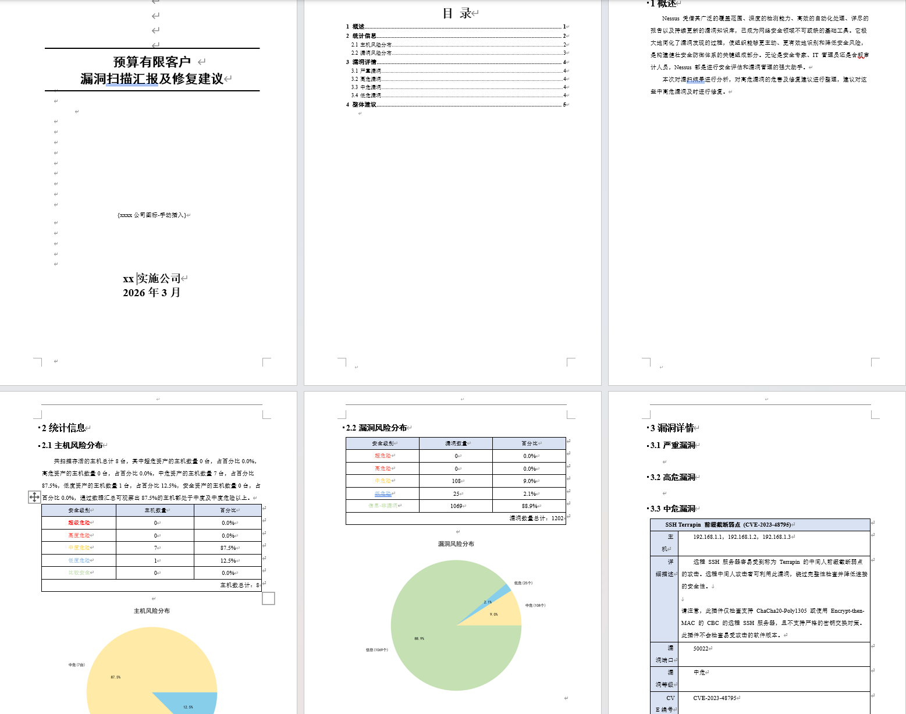
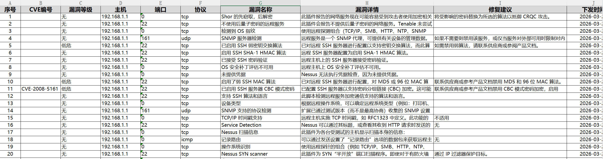

# Nessus\_zh\_report

## 📌 项目简介

之前项目上临时要漏扫，用nessus应急扫的，但是扫描结果是英文的且不符合公司和客户的报告格式，还需要翻译，很麻烦，网上的报告生成器也差点意思。所以当时就写了简单的能跑的报告生成工具然后手动再优化下，最近掏出来用发现不少问题，交给ai重构优化了下，Nessus\_zh\_report
能自动翻译nessus扫描结果并写入本地库中，支持 Excel 整改表和 Word 评估报告的批量生成。

## ✨ 功能特点

| 功能         | 描述                                  |
| ---------- | ----------------------------------- |
| **多格式支持**  | 同时支持 CSV 和 .nessus 两种 Nessus 导出文件格式 |
| **自动中文翻译** | 通过 Tenable API 获取中文漏洞数据，支持繁简自动转换    |
| **本地缓存**   | SQLite 数据库缓存翻译结果，避免重复 API 请求        |
| **智能风险评估** | 基于 CVSS 评分和漏洞等级计算主机风险等级             |
| **专业报告生成** | 自动生成格式化的 Excel 整改表和 Word 评估报告       |
| **灵活配置**   | 可自定义客户信息、输出路径和报告格式                  |
| **多文件处理**  | 支持单个或多个文件合并处理                       |
| **模块化架构**  | 清晰的代码分层，易于维护和扩展                     |

## 效果展示





## 🖥️ 系统要求

- **Python**: 3.7 或更高版本
- **操作系统**: Windows 10+ / macOS 10.14+ / Linux
- **内存**: 建议至少 4GB RAM
- **网络连接**: API 访问所需（可配置离线模式）

## 🚀 快速开始

### 1. 安装依赖

```bash
pip install -r requirements.txt
```

国内用户可使用镜像：

```bash
pip install -r requirements.txt -i https://pypi.tuna.tsinghua.edu.cn/simple/
```

### 2. 配置项目

编辑 `config/config.ini` 设置客户信息：

```ini
[DEFAULT]
客户名称 = 目标客户
实施公司 = 安全服务公司
```

### 3. 准备输入文件

将 Nessus 扫描结果文件放入 `target/` 目录：

- **CSV 格式**: Nessus 导出 → CSV
- **.nessus 格式**: Nessus 导出 → .nessus

### 4. 运行程序

```bash
python main.py
```

## 📁 项目结构

```
 Nessus_zh_report/
├── config/                      # 配置管理模块
│   ├── __init__.py
│   ├── constants.py             # 全局常量定义
│   └── settings.py              # 配置管理器
├── models/                      # 数据模型模块
│   ├── __init__.py
│   └── data_models.py           # 数据类定义
├── services/                    # 业务服务模块
│   ├── __init__.py
│   ├── database.py              # SQLite 数据库管理
│   ├── api_client.py            # Tenable API 客户端
│   └── translator.py            # 翻译服务
├── utils/                       # 工具函数模块
│   ├── __init__.py
│   ├── logger.py                # 日志配置
│   ├── csv_reader.py            # CSV 文件读取
│   ├── nessus_reader.py         # .nessus 文件读取
│   ├── statistics.py            # 统计计算
│   └── user_interface.py        # 用户交互界面
├── processors/                  # 数据处理模块
│   ├── __init__.py
│   └── vulnerability.py         # 漏洞处理器
├── generators/                  # 报告生成模块
│   ├── __init__.py
│   ├── excel.py                 # Excel 报告生成器
│   └── word.py                  # Word 报告生成器
├── main.py                      # 主程序入口
├── CHANGELOG.md                 # 变更日志
├── README.md                    # 本文件
├── config.ini                   # 配置文件
├── requirements.txt             # Python 依赖
└── nessus_plugins.db           # SQLite 缓存数据库
```

## 📖 使用说明

### 运行流程

程序启动后会显示交互式菜单：

1. **选择扫描文件**
   - 支持同时选择 CSV 和 .nessus 文件
   - `0` 处理所有文件
   - 输入序号选择单个文件
2. **选择漏洞输出等级**
   - `0` - 高危及以上漏洞（仅 Critical 和 High） - 默认
   - `1` - 全部漏洞
3. **选择报告格式**
   - `0` - Excel + Word 报告 - 默认
   - `1` - 仅 Excel 报告
   - `2` - 仅 Word 报告

### 支持的文件格式

#### CSV 格式

- Nessus 导出时选择 CSV 格式
- 支持多编码自动识别（UTF-8, UTF-8-SIG, GBK, GB2312）

#### .nessus 格式

- Nessus 原始导出格式（XML）
- 包含更完整的漏洞信息
- 支持多文件合并分析

### 输出文件

#### Excel 整改表: `漏洞整改表(YYYYMMDD).xlsx`

| 列名    | 说明          |
| ----- | ----------- |
| 序号    | 漏洞编号        |
| CVE编号 | CVE 编号      |
| 漏洞等级  | 超危/高危/中危/低危 |
| 主机    | 受影响主机       |
| 端口    | 漏洞端口        |
| 协议    | 通信协议        |
| 漏洞名称  | 漏洞中文名称      |
| 漏洞详情  | 漏洞详细描述      |
| 修复建议  | 漏洞修复建议      |
| 下发时间  | 报告生成日期      |
| 整改情况  | 预留用于填写整改状态  |

#### Word 评估报告: `漏洞扫描汇报及修复建议(YYYY_MM).docx`

包含以下内容：

- 📄 封面（客户名称、实施公司、公司图标）
- 📊 漏洞统计（漏洞和主机分布）
- 📈 风险分布图表（饼图可视化）
- 🔍 详细漏洞信息（按风险等级分组）

## ⚙️ API 配置

程序使用 Tenable API 获取中文漏洞信息：

- **API 域名**: `zh-tw.tenable.com`（繁体中文接口）
- **繁简转换**: 程序会自动将繁体中文转换为简体中文
- **本地缓存**: SQLite 数据库缓存已翻译的插件信息，避免重复请求

如需修改 API 域名，可编辑 `config/constants.py` 中的 `TENABLE_BASE_URL_CN` 或 `TENABLE_BASE_URL_TW` 常量。

## 📋 配置说明

`config.ini` 配置项：

```ini
[DEFAULT]
# 客户信息
客户名称 = 目标企业
实施公司 = 安全服务公司

# 文件路径配置
数据库路径 = nessus_plugins.db
模板文件路径 = ./config/漏洞扫描汇报及修复建议_漏洞排序模板.docx
公司图标路径 = ./config/qmxc.png

# 输出配置
输出目录 = ./reports/
Excel文件前缀 = 漏洞整改表
Word文件前缀 = 漏洞扫描汇报及修复建议
```

## 🔒 风险等级说明

| 英文       | 中文 | CVSS 分数    |
| -------- | -- | ---------- |
| Critical | 超危 | 9.0 - 10.0 |
| High     | 高危 | 7.0 - 8.9  |
| Medium   | 中危 | 4.0 - 6.9  |
| Low      | 低危 | 0.1 - 3.9  |
| Info     | 信息 | 0.0        |

## 📝 Word 模板修改

自定义Word模板中可使用以下占位符，程序会自动替换为实际数据：

### 客户信息

| 占位符          | 说明                  |
| ------------ | ------------------- |
| `{xxxx客户名称}` | 客户名称（来自 config.ini） |
| `{xxxx实施公司}` | 实施公司（来自 config.ini） |
| `{时间-年}`     | 当前年份                |
| `{时间-月}`     | 当前月份                |

### 主机统计

| 占位符                       | 说明        |
| ------------------------- | --------- |
| `{主机数总计}`                 | 主机总数      |
| `{超危主机-数量}` / `{超危主机-占比}` | 超危主机数及占比  |
| `{高危主机-数量}` / `{高危主机-占比}` | 高危主机数及占比  |
| `{中危主机-数量}` / `{中危主机-占比}` | 中危主机数及占比  |
| `{低危主机-数量}` / `{低危主机-占比}` | 低危主机数及占比  |
| `{安全主机-数量}` / `{安全主机-占比}` | 安全主机数及占比  |
| `{中危以上主机-占比}`             | 中危及以上主机占比 |

### 漏洞统计

| 占位符                       | 说明              |
| ------------------------- | --------------- |
| `{漏洞数量总计}`                | 漏洞总数            |
| `{超危漏洞-数量}` / `{超危漏洞-占比}` | Critical 漏洞数及占比 |
| `{高危漏洞-数量}` / `{高危漏洞-占比}` | High 漏洞数及占比     |
| `{中危漏洞-数量}` / `{中危漏洞-占比}` | Medium 漏洞数及占比   |
| `{低危漏洞-数量}` / `{低危漏洞-占比}` | Low 漏洞数及占比      |
| `{信息漏洞-数量}` / `{信息漏洞-占比}` | Info 漏洞数及占比     |

### 图表（替换为饼图）

| 占位符         | 说明       |
| ----------- | -------- |
| `{主机风险分布图}` | 主机风险分布饼图 |
| `{漏洞风险分布图}` | 漏洞风险分布饼图 |

### 漏洞详情（替换为动态表格）

| 占位符        | 说明            |
| ---------- | ------------- |
| `{严重漏洞详情}` | Critical 漏洞详情 |
| `{高危漏洞详情}` | High 漏洞详情     |
| `{中危漏洞详情}` | Medium 漏洞详情   |
| `{低危漏洞详情}` | Low 漏洞详情      |

> **提示**：新增模板只需包含上述占位符即可正常生成报告。

## ❓ 常见问题

### 1. 文件读取失败

**CSV 文件**：确保编码为以下之一：

- UTF-8
- UTF-8-SIG
- GBK
- GB2312

\*\* Nessus 文件\*\*：确保文件完整性，XML 格式无损坏

### 2. API 请求失败

- 检查网络连接
- 确认防火墙设置
- 增加请求超时时间

### 3. Word 报告目录无法自动更新

如遇此情况，请手动更新：

1. 打开 Word 文档
2. 按 `Ctrl+A` 全选
3. 按 `F9` 更新域

### 4. 数据库锁定错误

确保 `nessus_plugins.db` 文件未被其他进程占用。

## 🔧 自定义说明

1. **添加新的报告格式**
   - 在 `generators/` 目录中添加新的生成器类
   - 继承 `ExcelReportGenerator` 或 `WordReportGenerator`
2. **集成新的翻译服务**
   - 在 `services/translator.py` 中扩展翻译方法
   - 支持多种翻译源作为备选
3. **添加新的统计指标**
   - 在 `utils/statistics.py` 中添加统计函数
   - 更新 `models/data_models.py` 中的数据结构
4. **支持新的数据源**
   - 在 `utils/` 中添加新的读取器类
   - 在 `processors/` 中实现数据转换逻辑

## 📜 许可证

MIT License
